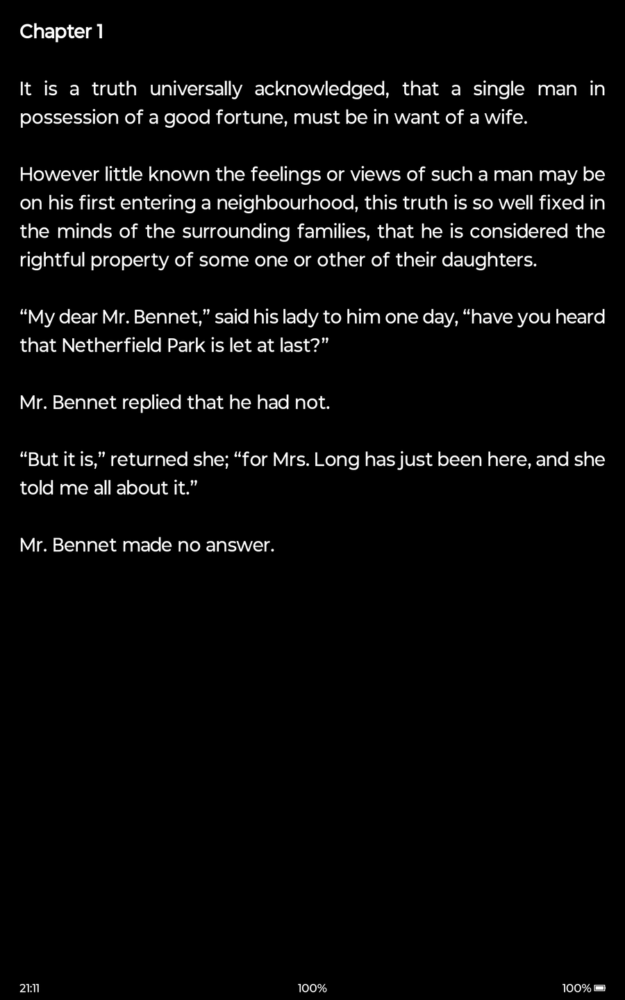
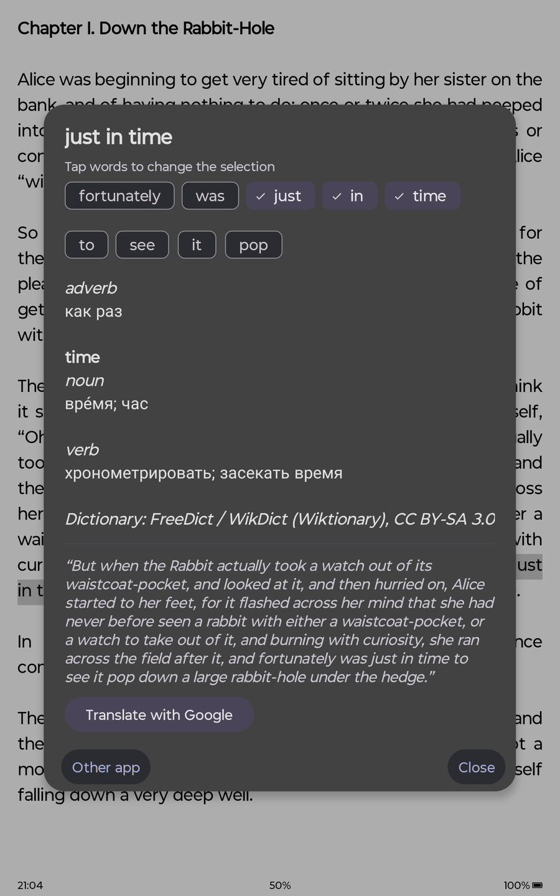
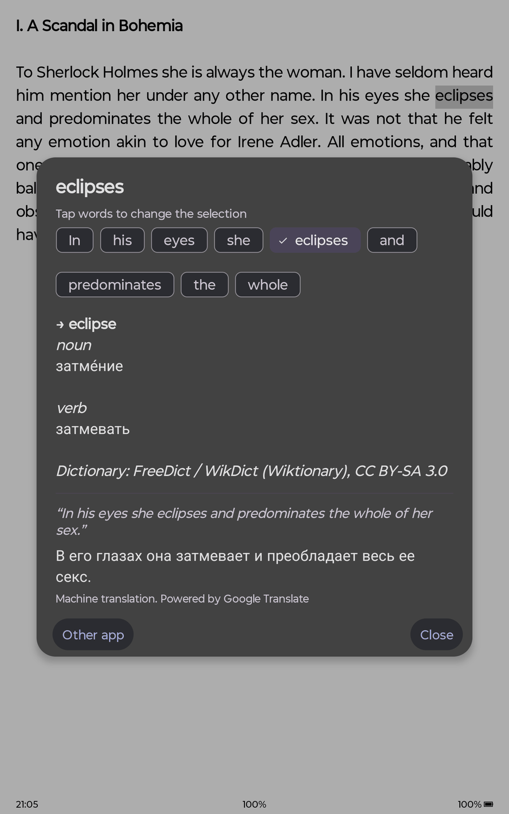
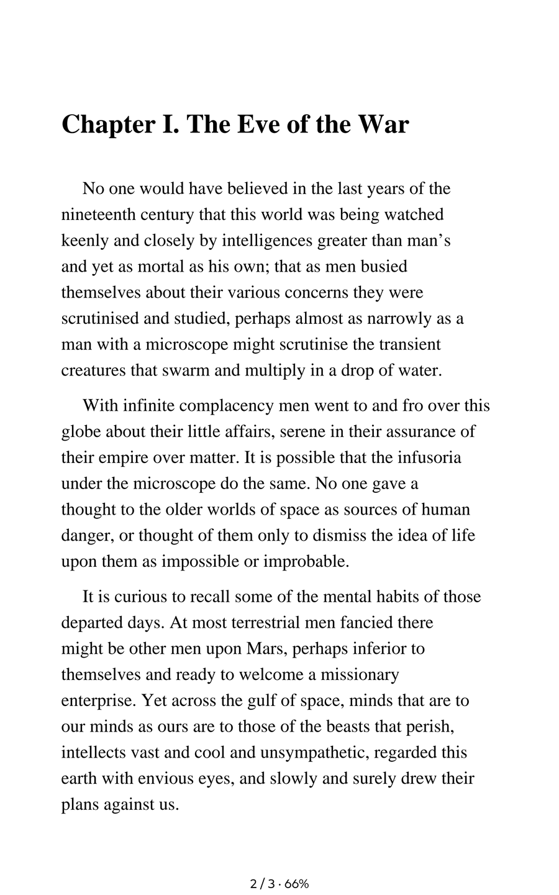
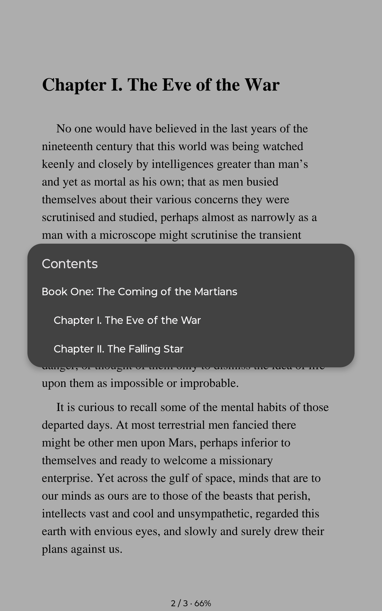

# Vellum Reader

**A calm FB2 and PDF reader for Android, made for E-Ink screens and just as good on any phone or tablet.**
Pure high-contrast pages, no animations, and an English → Russian dictionary and sentence translator that work offline, right where you read.

## Screenshots

  
  
  

<em>Your library with covers, series and progress · a calm reading page · a dark theme for the evening</em>

  
  

<em>Long-press a word: the offline dictionary finds the phrase (<b>just in time</b> → «как раз»), and the whole sentence can be translated on the device</em>

  
  
  

<em>A real PDF reader with the document's contents · fonts, spacing and margins per book</em>

## Highlights

**Read comfortably**
- **FB2, FB2.ZIP and PDF** in one library, with covers, authors, series and reading progress.
- **Built for E-Ink**: no animations or gradients, anti-ghosting refresh, dedicated support for Onyx Boox screens (refresh modes, warm and cold backlight), and it works the same on any Android 11+ device.
- **A real PDF reader** on Pdfium: table of contents, full-text search with highlighted matches, pinch and double-tap zoom that fits the text column to your screen, margin cropping that makes small-screen reading pleasant, night mode, password-protected files.
- **Your book, your way**: fonts (including your own `.ttf` / `.otf`), sizes, spacing, margins, justified text, Light / Sepia / Dark themes, remembered per book. Bookmarks, footnotes, in-book search and a table of contents.
- **Gentle on the battery**: choose how long the screen stays on while you read (5, 10 or 30 minutes, or always).

**Look up and translate as you read**
- **Long-press a word** to get its Russian translation with parts of speech and senses, from a compact **offline dictionary** (about 78,000 entries, including 15,000 phrases and idioms). It understands word forms (*running*, *children*, *went* → *run*, *child*, *go*).
- **Phrases**: *as well as*, *in order to*, *ran out of* are recognized automatically; tap the words around your finger to select a different phrase yourself.
- **Whole sentences** (`mlkit` edition): press **Translate with Google** to translate the sentence around the word, on the device, without sending your text anywhere.
- Words the dictionary doesn't know can be passed to any dictionary app you have installed.

**Yours to keep**
- **Backup and restore** your reading progress and preferences to a file you choose.
- A fast, private library: everything stays on your device.

## Download

Get the latest APK from **[Releases](https://github.com/andrewchuev/vellum/releases/latest)**. Every release has two editions:

| Edition | Size | Choose it if |
|---|---|---|
| **`mlkit`** (recommended) | ~40 MB | you want sentence translation as well as the dictionary |
| **`basic`** | ~11 MB | you want the smallest install with no closed-source components |

Requires **Android 11 or newer** on an ARM device (nearly all phones, tablets and E-Ink readers).

## Getting started

1. Open **Vellum** and tap **Scan Storage** (or **Open New Book**) to add your FB2 and PDF files. Android will ask for "All files access" so it can find them.
2. Tap a book to read. **Tap the center** for the menu; tap the **left / right sides** or use the **volume keys** to turn pages.
3. **Long-press a word** to translate it. The first time, the app offers to download the dictionary (about 1.8 MB); the `mlkit` edition also offers the sentence models (about 41 MB) when you first ask for a sentence.

## Privacy

Your books, notes and reading history never leave your device and there are no analytics. The app asks for internet access only to download the dictionary once and, in the `mlkit` edition, Google's translation models once. After that, reading and translating work offline.

## Credits and licenses

- **Dictionary data**: [FreeDict](https://freedict.org/) *eng-rus* and *rus-eng*, generated by WikDict from Wiktionary, licensed **CC BY-SA 3.0**. Credit is shown in the lookup dialog.
- **Sentence translation** (`mlkit` edition): Google ML Kit on-device translation. It is intended for casual, everyday text and is not a literary translator; translations carry Google's attribution.
- **PDF rendering**: [Pdfium](https://pdfium.googlesource.com/pdfium/) through the `pdfiumandroid` library.

---
*Created with focus on simplicity and reading comfort.*
