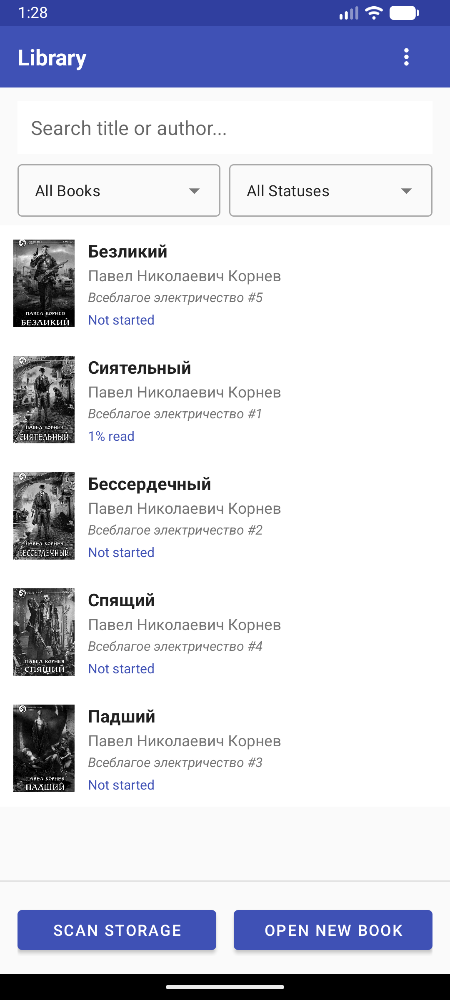
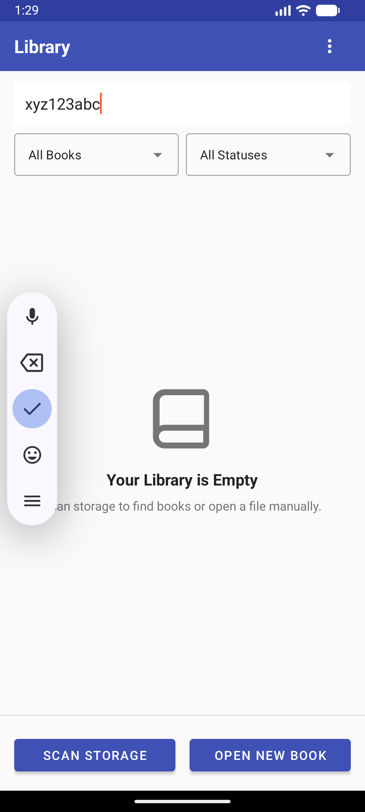
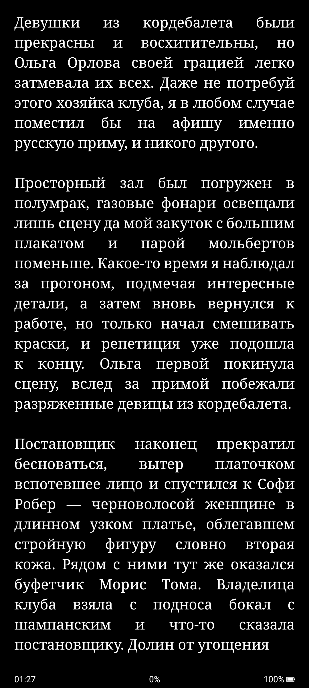
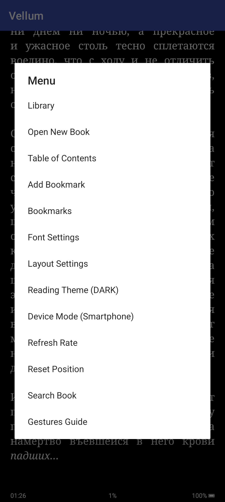
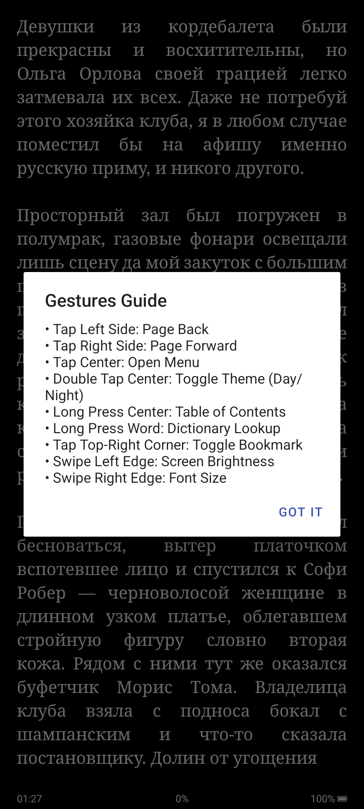

# Vellum Reader

A minimalist, high-performance FB2 ebook reader optimized specifically for **E-Ink devices** (like Onyx Boox Page). Built from scratch with a focus on speed, high contrast, and battery efficiency.

## Screenshots

  
  
  

  
  

* **Library View**: Shows cover images, titles, authors, read progress, and book series information. Built with Material Design Exposed Dropdown menus.
* **Empty State View**: Displays a clean book vector illustration when the library or search result list is empty.
* **Reader View**: Pure, distraction-free high-contrast reading text layout with clock and progress details in the bottom status bar.
* **Reader Menu**: Configurable font, layout, theme, and mode options.
* **Gestures Guide Dialog**: On-demand overlay detailing all tap, swipe, and touch shortcuts.

---

## Key Features

- **Optimized for E-Ink**: No animations, no gradients, pure black-on-white rendering.
- **Hardware Integration**: Custom support for Onyx Boox E-Ink screens (refresh modes, dual warm/cold brightness control).
- **Universal Compatibility**: Works on any Android 11+ device thanks to an abstraction layer over hardware-specific SDKs.
- **Fast FB2 Engine**: Custom XmlPullParser-based streaming parser handles large books with minimal memory footprint.
- **Support for .fb2 and .fb2.zip**: Open compressed books directly from your storage.
- **Instant Loading & Background Pagination**: The book opens instantly (< 2ms) by calculating and rendering the current page first. Full pagination is calculated asynchronously in the background on a thread pool (`Dispatchers.Default`), ensuring zero UI lag.
- **Justified Text Alignment**: Native full-width inter-word justification alignment (`Layout.JUSTIFICATION_MODE_INTER_WORD`) for clean and balanced layout on both edges.
- **Library Management**: Persistent local library with covers, metadata, and reading progress tracking. Includes options for physical file deletion when removing books.
- **Folder-Specific Scanning**: Multi-choice checklist dialog during storage scan to target specific folders (`Books`, `Download`, `Documents`) or scan the entire device.
- **Backup & Restore**: Export and import your library database, preferences, and reading progress as JSON files (`vellum_library_backup.json`).
- **Automated Book Scanner**: Background storage scanner recursively searches external storage for `.fb2` and `.zip` files, extracts metadata, saves cover images, and registers books to the library, automatically skipping duplicates.
- **E-Ink Friendly Grouping & Filtering**: Group books by **Authors** and **Series/Sequences** using alphabetical navigation folders. Sort books in a series by sequence order, and filter library lists instantly by status (**Reading**, **Unread**, **Finished**).
- **Reactive UI**: Library updates automatically using Kotlin Coroutines Flow when books are added, opened, or scanned.
- **Per-Book Settings**: Remembers font size, line spacing, font family, and margins individually for every book. Font size and spacing changes render instantly on screen without blocking loading dialogs.
- **Navigation Options**:
    - **Physical Buttons**: Use volume keys to turn pages.
    - **Touch Zones**: Left/Right sides for paging, Center for menu.
- **Footnotes & Bookmarks**:
    - **Footnotes**: View annotations and author notes in a popup without leaving the current page.
    - **Bookmarks**: Save bookmarks at any position, listed in a modern dialog with dividers, padding, and styled high-contrast controls.
- **Dictionary Lookup Integration**: Long-press any word in the book to highlight it and look it up instantly using standard Android dictionary/translation intents (works with ColorDict, GoldenDict, etc.).
- **Custom Fonts Support**: Scan and load external `.ttf` or `.otf` fonts dynamically from `/sdcard/Fonts` directory.
- **Full-Text Search**: Search for words or phrases inside the currently open book, preview matching snippets, jump to the matches, and view highlighted occurrences on screen.
- **Advanced E-Ink Anti-Ghosting**: Full-screen updates are triggered after page turns and automatically on all dialog dismissals to instantly clear ghosting outlines and artifacts.
- **Night Mode**: Software-level color inversion for comfortable low-light reading.

## Recent Best-Practice & Performance Improvements

- **High-Performance Image Dithering**: Replaced inefficient 2D array allocations in Floyd-Steinberg dithering with a flat 1D array (`IntArray(width * height)`) and leveraged batch `getPixels`/`setPixels` operations, bypassing Java/C++ JNI pixel-by-pixel call overhead.
- **Asynchronous Disk and Image I/O**: Offloaded cover processing (`saveCoverImage`), JSON backup generation (`BackupUtils.exportBackup`), and file deletions to `Dispatchers.IO` background threads to prevent UI freezes and ANRs.
- **RecyclerView Optimization**: Refactored the main library adapter (`BookAdapter`) to extend `ListAdapter` with `DiffUtil` and offloaded cover bitmap decoding to background coroutines with dynamic ViewHolder job cancellation and an in-memory `LruCache` cache.
- **Dynamic Anti-Aliasing**: Configured text rendering anti-aliasing dynamically. Anti-aliasing is enabled by default to ensure clean typography on normal smartphone screens, and disabled only when E-Ink optimization is active.
- **ViewModel-Driven Reader Flow**: The reader screen's book/pagination/bookmark/style/search state now lives in `ReaderViewModel` (StateFlow + SharedFlow for events) instead of the Activity, mirroring the library screen's existing MVVM pattern.
- **ViewBinding Everywhere**: All `findViewById` calls across both Activities and the library adapter were replaced with generated view bindings for compile-time null-safety.
- **Deduplicated Core Algorithms**: `Fb2Parser`'s four near-identical XML-parsing paths and `PaginationController`'s two near-identical page-fitting loops were consolidated into shared helpers, each backed by regression tests.
- **Database Migration Safety**: `AppDatabase` uses an explicit, documented `fallbackToDestructiveMigration` rather than crashing on every schema bump with no migration path — a pragmatic tradeoff for this project's current scale, to be replaced with real `Migration` objects before a release with a meaningful install base.

## Technical Architecture

The project follows **Clean Architecture** principles to ensure maintainability and testability:

- **Domain Layer**: Contains business logic, models (`Book`), and repository interfaces.
- **Data Layer**: Implements repositories using Room Database for persistence and a custom FB2 parser.
- **Logic Layer**: Handles complex tasks like asynchronous pagination, storage scanning, and hardware-specific E-Ink management.
- **UI Layer**: MVVM pattern throughout — `LibraryViewModel` and `ReaderViewModel`, both `StateFlow`-driven, with ViewBinding-based Activities.
- **Dependency Injection**: A single lightweight `AppContainer` (held by `VellumApplication`) is the composition root for both Activities — no DI framework, proportionate to the app's size.

## Technical Stack

- **Language**: Kotlin 2.1+
- **Concurrency**: Kotlin Coroutines & Flow
- **Persistence**: Room Database (SQLite)
- **UI**: Native Android Canvas + StaticLayout (No WebView), ViewBinding for dialogs/Activities
- **Testing**: JUnit4 + Robolectric + kotlinx-coroutines-test for parser, pagination, settings, backup, scanner and ViewModel unit tests
- **Build System**: Gradle Version Catalog for centralized dependency management, dependencies tracked against current stable releases
- **Min SDK**: 30 (Android 11)
- **Target SDK**: 34

## How to Use

1. Launch **Vellum**.
2. The **Library** shows your recently opened books.
3. Tap **Scan Storage** to search targeted folders (e.g. `Books`, `Download`, `Documents`) or the entire device for FB2 books. (Requires granting "All Files Access" permission on Android 11+).
4. Tap **Open New Book** to manually select a specific FB2 or ZIP file using the system file picker.
5. Filter or group your library by clicking the dropdown menus (e.g., group by Author or Series, or filter by Finished books).
6. Tap **Backup** to export your reading progress and preferences, or **Restore** to choose a backup JSON file and restore your library.
7. Tap the center of the reader screen to open the **Menu**.
8. Long-press any book in the **Library** to prompt options to delete only from library or physically delete from device.
8. Use **Volume Buttons** or **Screen Edges** to navigate through pages.

---
*Created with focus on simplicity and reading comfort.*
